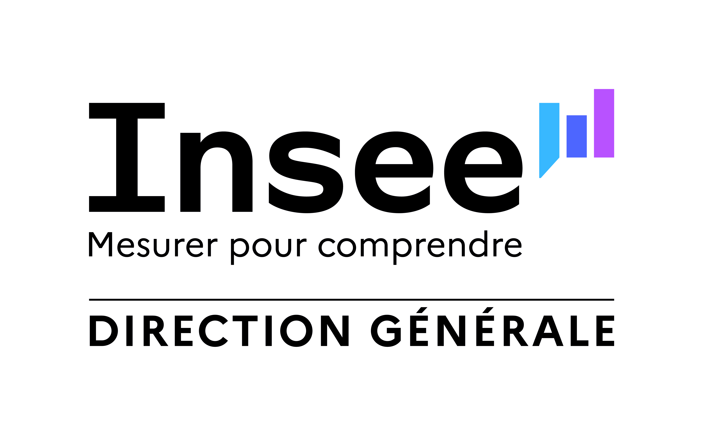
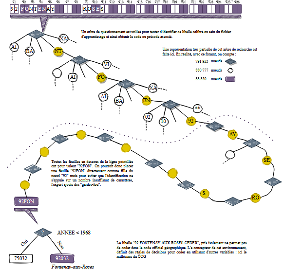

# Contexte de la mise en place du nouveau service de codification {#chapters_0 .backgroundTitre_bleu}

:::{.logoTopRightTitre}
"
:::

## Sicore depuis 1993 {#section_0_1 .backgroundStandard_bleu}

- Depuis plus de 30 ans, Sicore assure la codification dans les différentes nomenclatures à l’Insee

- Sicore : Système Informatique de Codage de Réponse aux Enquêtes

- Système expert construit autour de 3 moteurs de règles : 
  - règles de normalisation (caractères blancs, vides, synonymes, calibrage)
  - règles d'identification du libellé dans un index
  - règles logiques avec variables annexes

## Titre transparent {#section_0_2 .backgroundStandard .titreTransparent .rehausserContenuSansTitre data-menu-title="Slide sans titre ni numérotation"}

:::{.centerImage}

:::

## Sicore {#section_0_3 .backgroundStandard_bleu}

- Mais plusieurs limites à son usage sont apparues :
  - logiciel devenu difficilement maintenable ;
  - pas de possibilité de maîtriser le volume de libellés envoyés en reprise manuelle ;
  - maintenance lourde des fichiers de connaissance pour certaines nomenclatures.
- Début 2022, travaux pour mettre en place un nouveau système de codification
