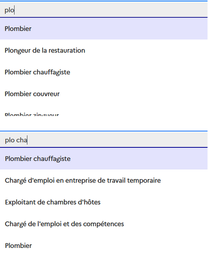
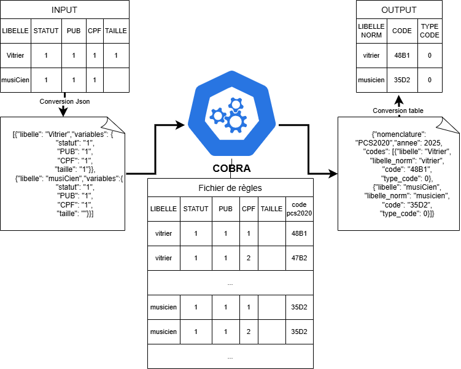
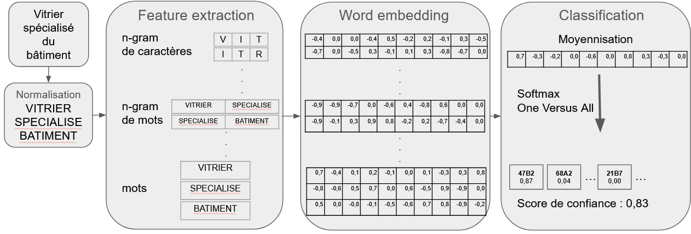
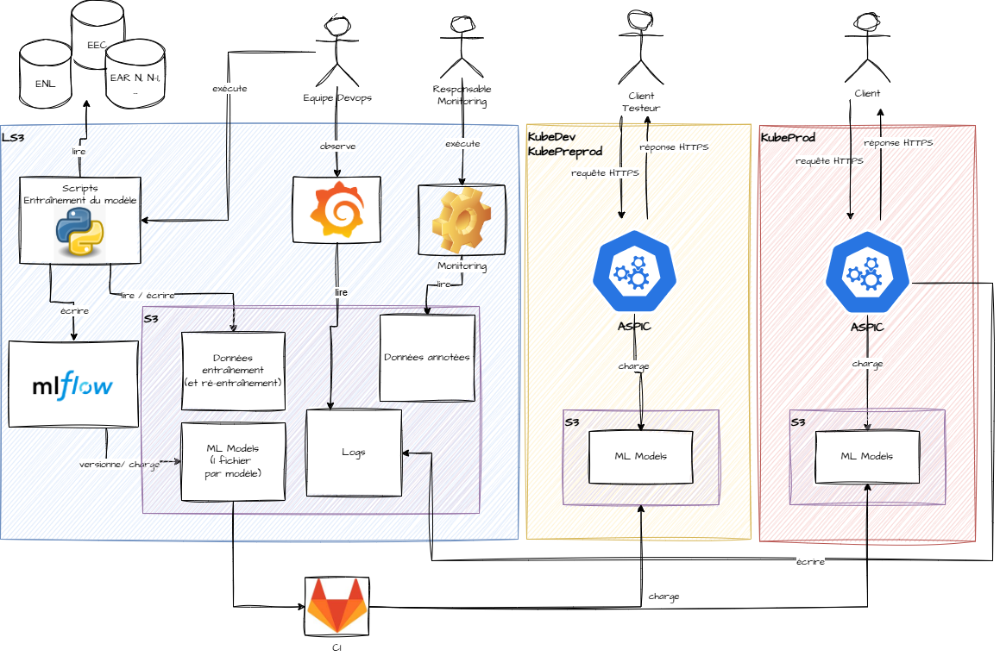

# Les outils {#chapters_1 .backgroundTitre_violet}

## Le suggester {#section_1_1 .backgroundStandard_violet .scrollable}

- Outil d’autocomplétion
- Composant javascript embarqué dans les questionnaires des enquêtes ménages et dans le recensement
- nécessite des listes de libellés construites par des experts
- Outil paramétrable : 
  - affichage échos à partir de 3 caractères saisies
  - liste de synonymes
  - stopwords

## Titre transparent {#section_1_2 .backgroundStandard .titreTransparent data-menu-title="Slide sans titre ni numérotation"}

:::{.centerImage}

:::

## Cobra {#section_1_3 .backgroundStandard_violet .scrollable}

- Codification basée sur des règles automatisés
- Service web développé en langage Python
- Codification déterministe en deux étapes : 
  - Normalisation
  - Conversion du libellé normalisé (et des variables additionnelles) en un code par l’intermédiaire d’un fichier de règles
- permet : 
  - En première intention, codage des libellés saisis sur liste
  - En deuxième intention, codage des libellés saisis en clair

## Titre transparent {#section_1_4 .backgroundStandard .titreTransparent data-menu-title="Slide sans titre ni numérotation"}

- Nomenclatures disponibles: 
  - NAF (2 positions) / PCS 2020 / ISCO-08
  - Niveaux / Diplômes
  - PCS 2020 pour les Déclarations Sociales Nominatives (DSN)
  - Communes / Pays / Nationalités / Langues
- Possibilité d’appeler plusieurs millésimes
- Bac-à-sable disponible pour les experts des nomenclatures

## Titre transparent {#section_1_5 .backgroundStandard .titreTransparent data-menu-title="Slide sans titre ni numérotation"}
::: columns
::: column
- Normalisation
- Mapping
- Renvoi de la 1ère correspondance
- Renvoi du type de code complet
  - partiel
  - incohérent
  - inconnu

::: 

::: column
:::{.centerImage}

:::

:::
:::

## Aspic {#section_1_6 .backgroundStandard_violet .scrollable}

- Application de sélection probabiliste pour l’identification d’un code
- Service web développé en langage Python 
- Codification probabiliste basée sur des outils de traitement du langage naturel et de machine learning en trois étapes : 
  - Normalisation du libellé
  - Word embedding
  - Classifieur
- renvoie : 
  - la meilleure prédiction et le score de confiance associé
  - les 5 meilleures prédictions et leur probabilité associée

## Titre transparent {#section_1_7 .backgroundStandard .titreTransparent data-menu-title="Slide sans titre ni numérotation"}

- Nomenclatures disponibles : 
  - NAF 2008 (2 positions)
  - PCS 2020 (3 modèles selon si l’enquêté est “salarié”, “indépendant” ou “autre”)
- Bibliothèque utilisée en production : fastText (Meta)
  - Avantages : 
    - Word embedding + Classifieur
    - Rapide et coût informatique léger (CPU)
    - Fonctionne sur CPU
  - Inconvénients :
    - Contournement pour prendre en compte les variables annexes
    - Modèle difficilement interprétable
    - Archivage par Méta en mars 2024

## Titre transparent {#section_1_8 .backgroundStandard .titreTransparent data-menu-title="Slide sans titre ni numérotation"}

:::{.centerImage}

:::

## Aspic - Ecosystème {#section_1_9 .backgroundStandard_violet .scrollable}

:::{.centerImage}

:::