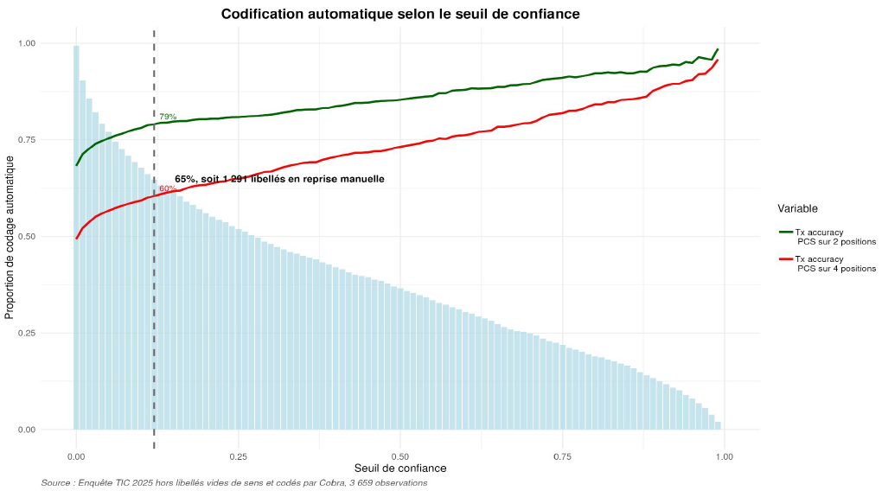
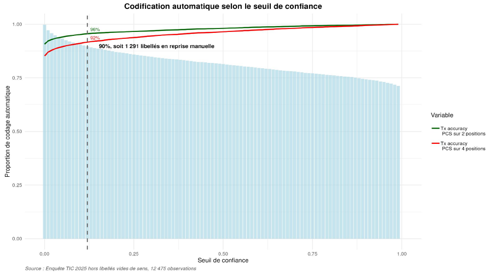

# Quelques résultats {#chapters_3 .backgroundTitre_bleu}

## Enquête TIC {#section_3_1 .backgroundStandard_bleu}

Enquête TIC auprès des ménages :
- Objectif : collecter des informations décrivant l'équipement des ménages et leurs usages dans le domaine des nouvelles technologies
- Taux de recours à la liste des libellés en 2025 : 61 %

| Recours à la liste | Codification   4 positions | Codification   < 4 positions | Échec de la codification |
|:---------|------:|------:|:------:|
| Non (39 %)      | 27 %   |    2 % |   71 %   |
| Oui (61 %)     | 99 %  |   1 % |  0 %   |

: **Résultats de la codification par Cobra**

_Source : Enquête TIC 2025, hors libellés vides de sens_

## Titre transparent {#section_3_2 .backgroundStandard .titreTransparent data-menu-title="Slide sans titre ni numérotation"}

:::{.centerImage}

:::

## Titre transparent {#section_3_3 .backgroundStandard .titreTransparent data-menu-title="Slide sans titre ni numérotation"}

:::{.centerImage}

:::